# Java大作業
171860641 江嘉晉

## 使用指南
打開程序可以看到主界面

可以使用數字鍵1~7選擇隊形，如按下數字鍵7的隊形為鋒矢
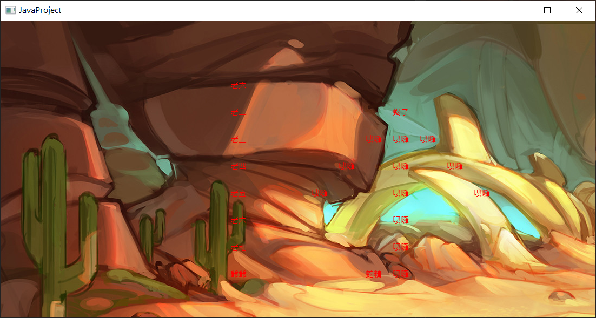

按下L鍵可以選擇log文件去重演之前的戰況
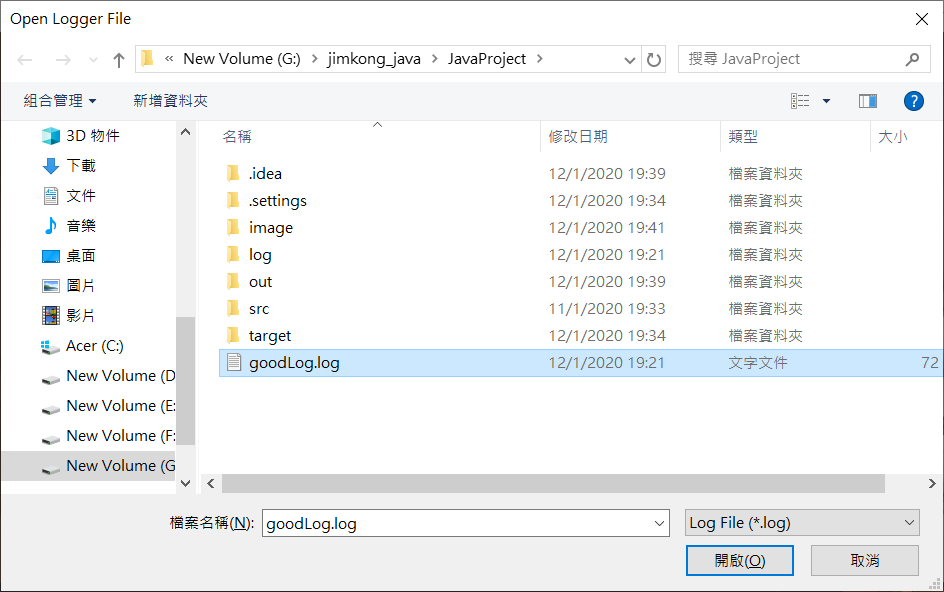

按下space鍵會以當前選擇的隊形進行戰爭
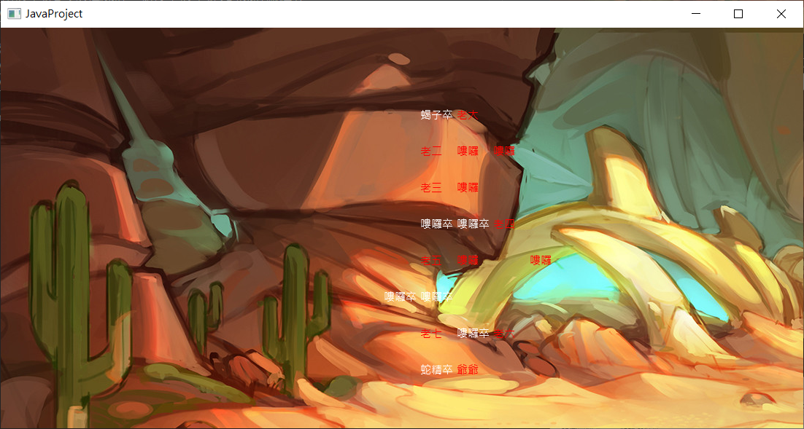

完成戰爭後會在log文件夾中生成log文件
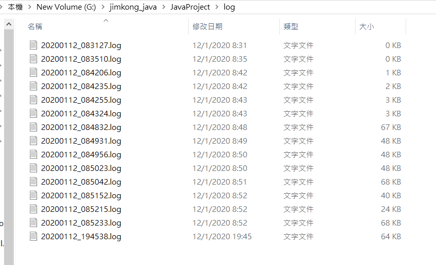

## 設計過程

### UML類圖
<table><tr><td bgcolor=white>

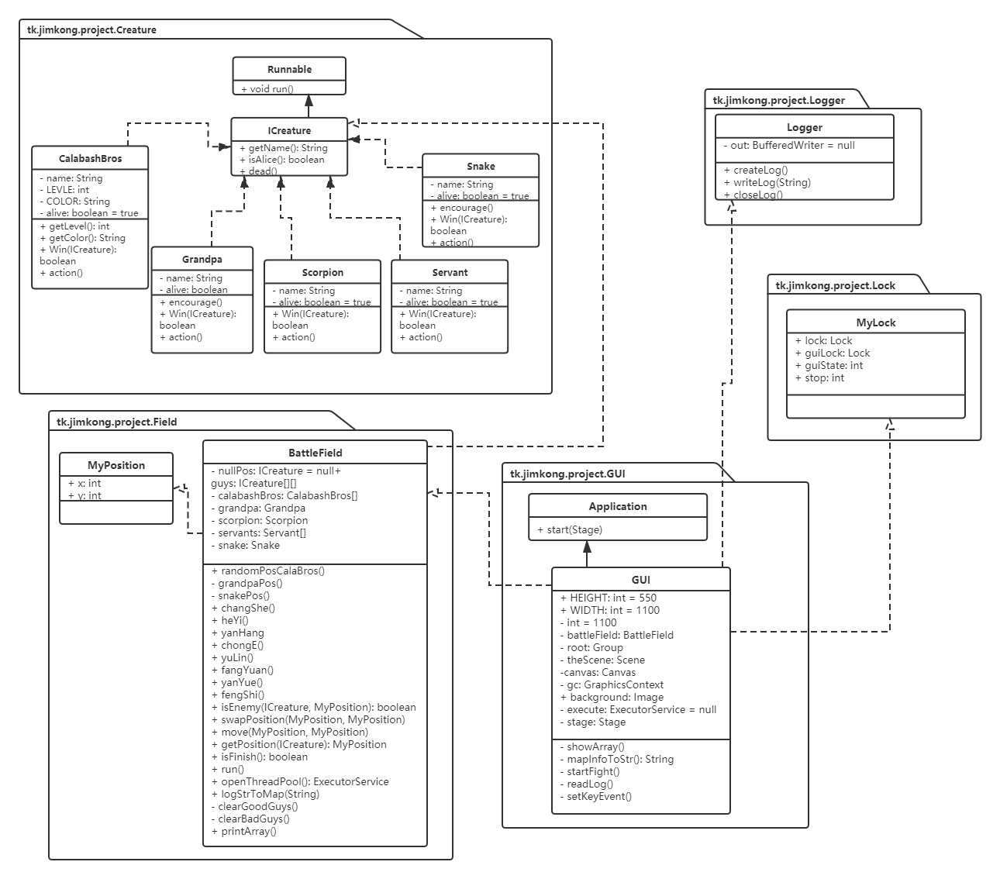

</td></tr></table>

### 接口
生物都會實現ICreature，因為有了這個接口令在保存和處理戰場信息的時間可以方便地統一地使用ICreature接口去指定各個生物。
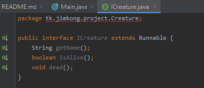
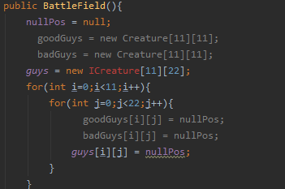

### 多線程
在每次進行戰爭的時候都會新增一個線程去處理戰爭的GUI顯示
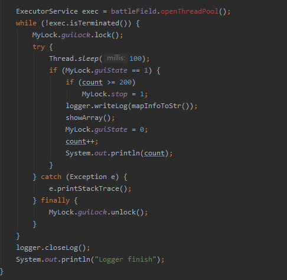

同理，在從log文件中重現戰況時也會
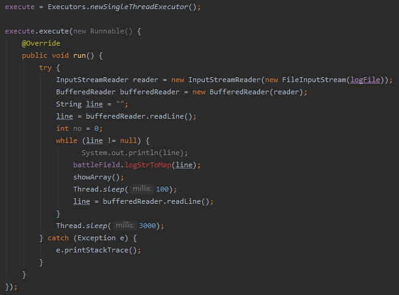

在每次戰場的時候，每個生物都為一個task，再由空閒的線程去運行各task
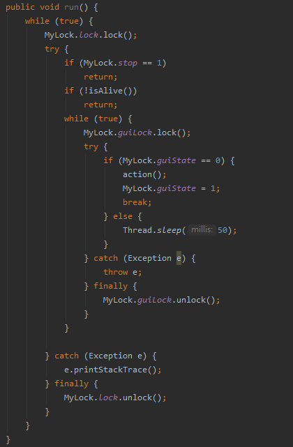

在實現多線程過程中為保證安全性一定會用到lock的，故在同一時間上只能有一個生物線程在運行，和在更新GUI時也只能有GUI在運行。
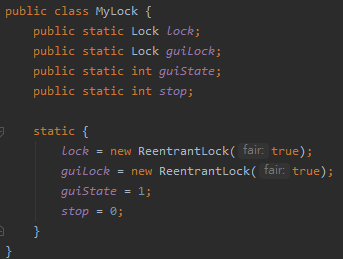
